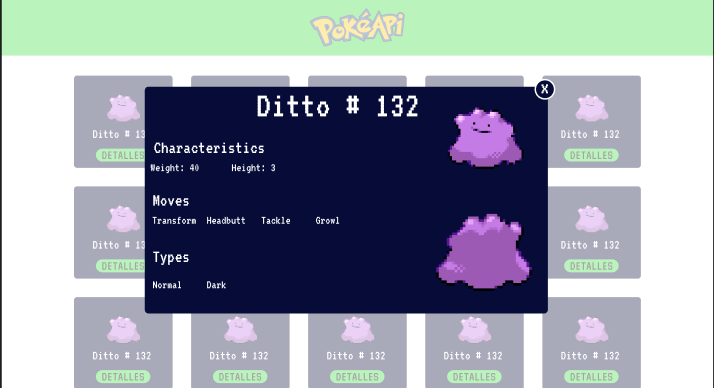

## PokeAPI Practice Project


## Introduction

Hello FlattWorldnian, in this exercise you will need to create the webpage designed [Here](https://www.figma.com/file/ReiOBlB6ixtZEK8PCagTlP/pokeApi?node-id=0%3A1) using only Javascript and CSS!

Alson you will need the Pokémon API [PokeAPI Documentation](https://pokeapi.co/).

## Getting started
1.- First you need to download this repository.

 ```sh
  $ git clone https://github.com/FlattWorld/pokeApi-project.git
  ```
2.- Then open the project directory with your text editor.

3.- Check the HTML file, you will need to note the id of the div, all your javascript code will be appending into that one div.
### NOTE
You should NOT edit the HTML file.

4.- Create a new branch

 ```sh
  $ git checkout -b NombreDeTuRama
  ```

  ** Dont Forget to change [NombreDeTuRama] with a different name eg: abelPage **

5.- Start working on the Javascript file.

## Useful Links

- [Create Elements Using Javascript](https://developer.mozilla.org/en-US/docs/Web/API/Document/createElement)

- [How to use an API](https://developer.mozilla.org/en-US/docs/Web/API/Fetch_API/Using_Fetch)

- [DOM manipulation](https://developer.mozilla.org/en-US/docs/Learn/JavaScript/Client-side_web_APIs/Manipulating_documents)

- [OnCLick Event](https://developer.mozilla.org/es/docs/Web/API/Element/click_event)

- [Add Classes using Javascript](https://developer.mozilla.org/es/docs/Web/API/Element/classList)

- [Git Course](https://www.youtube.com/watch?v=VdGzPZ31ts8)


## Step by Step Guide

## How to submit for a review

Stage your changes

 ```sh
  $ git add .
  ```

Push your changes to github

 ```sh
  $ git push -u origin NombreDeTuRama
  ```
  ** Don't Forget to change [NombreDeTuRama] with the name you created it before **
 


